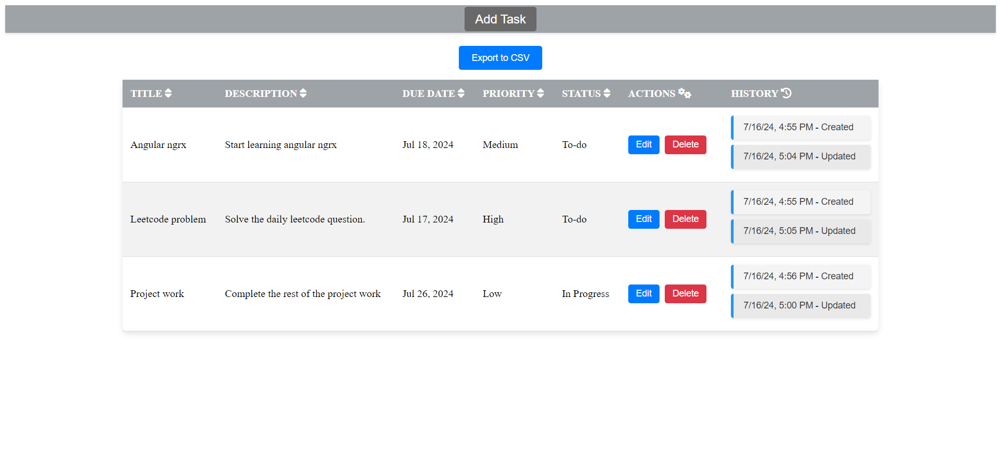
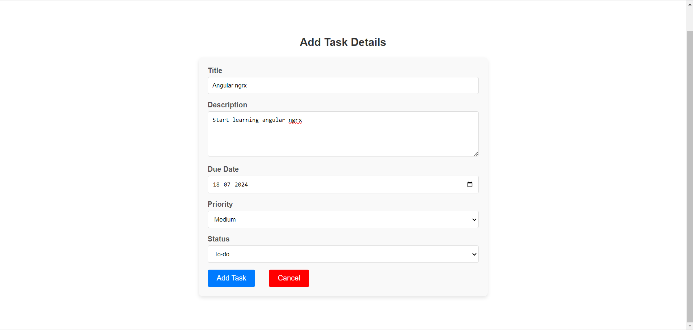
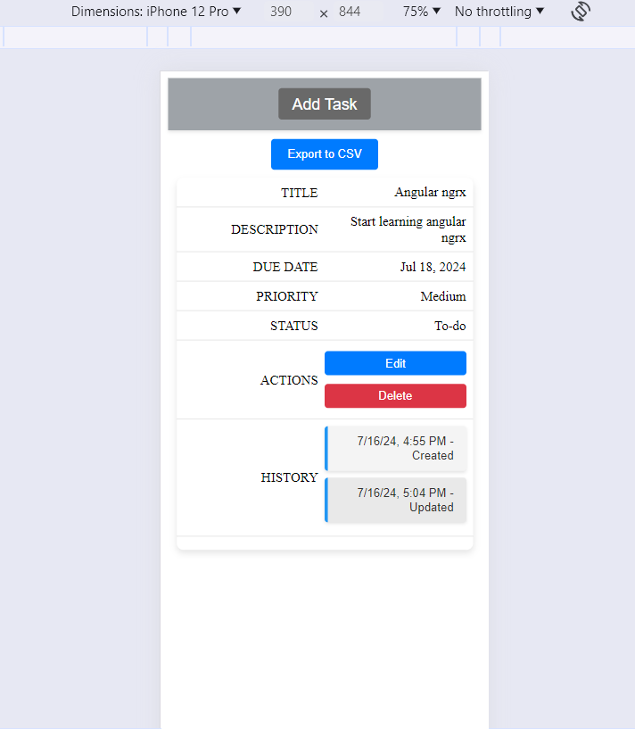
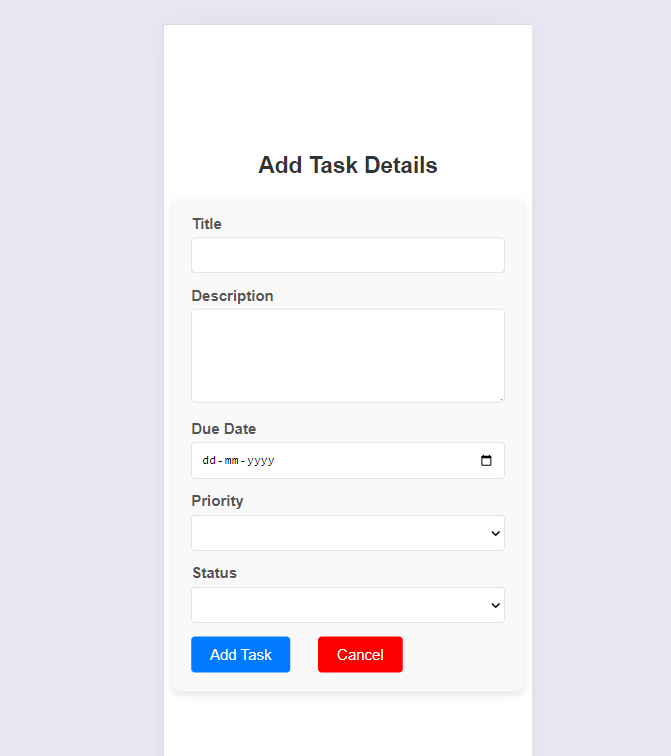
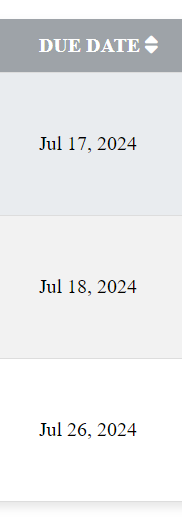
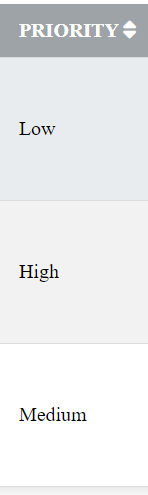
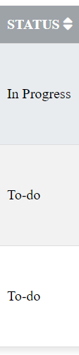

# TaskManager

This project was generated with [Angular CLI](https://github.com/angular/angular-cli) version 18.1.0 along with ngrx store.

## Live demo

https://task-manager-brown-phi.vercel.app/

## Development server

Run `ng serve` for a dev server. Navigate to `http://localhost:4200/`. The application will automatically reload if you change any of the source files.

## Build

Run `ng build` to build the project. The build artifacts will be stored in the `dist/` directory.

## Project Screenshots 

Desktop view

Mobile view

## Project Functionalities

1. Users can add new tasks with a title, description, due date, and priority level (low, medium, high).
2. Users can also update the status of tasks (to-do, in-progress, completed) and also edit or delete tasks.
3. Users can sort the tasks on the basis of due date, priority, status.

4. Users can export the tasks to a CSV file.
5. A history log shows all the changes made to each task.