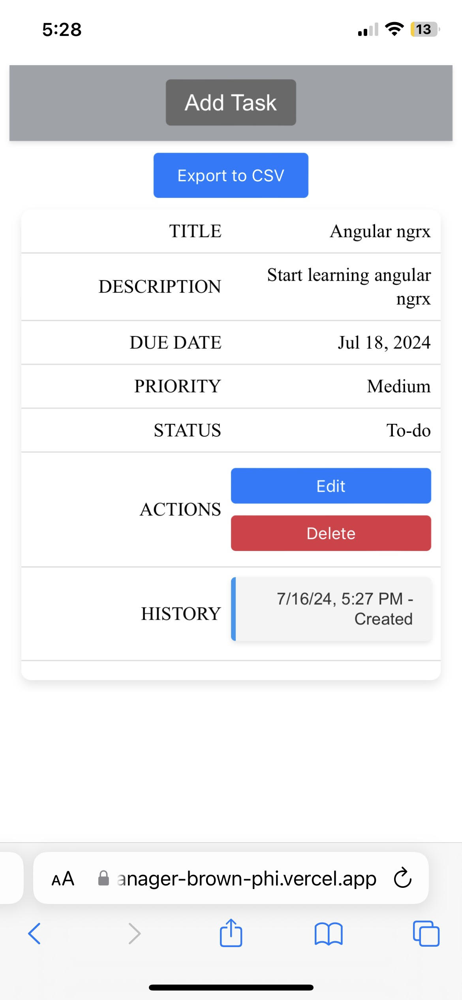
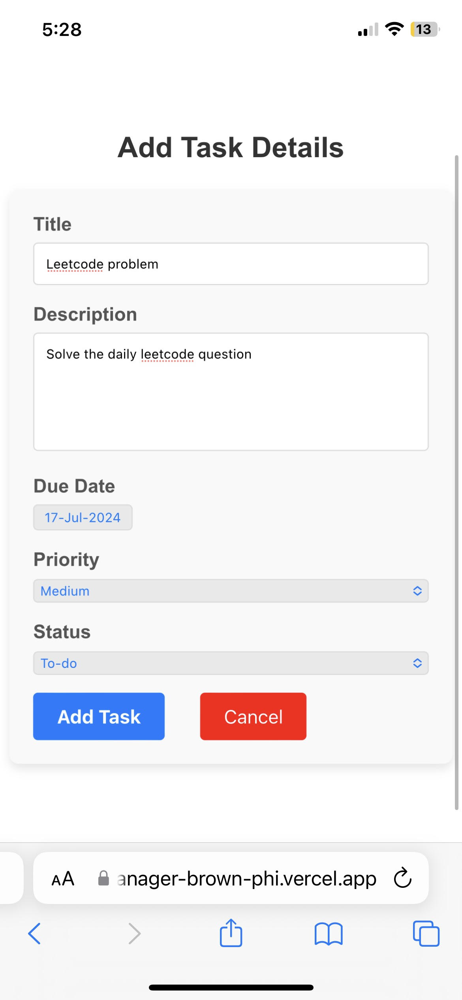

# TaskManager

This project was generated with [Angular CLI](https://github.com/angular/angular-cli) version 18.1.0 along with ngrx store.

## Live demo

https://task-manager-brown-phi.vercel.app/

## Development server

Run `ng serve` for a dev server. Navigate to `http://localhost:4200/`. The application will automatically reload if you change any of the source files.

## Build

Run `ng build` to build the project. The build artifacts will be stored in the `dist/` directory.

## Project Screenshots 

Desktop view

Mobile view

## Project Functionalities

1. Sorts the tasks on the basis of due date, priority, status
